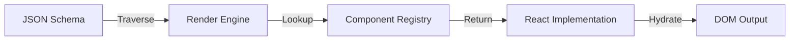

# FlexiSite CMS - System Architecture Blueprint

**Version:** 1.0.0
**Status:** Draft - Approved for Implementation
**Author:** Senior System Architect
**Date:** 2026-02-03

---

## 🏗️ 1. System Overview

FlexiSite CMS is a high-performance, headless, no-code visual builder designed for scalability and embeddability. Unlike traditional monolithic CMS platforms, FlexiSite is architected as a **Component-Driven platform** where the output is JSON-serializable configurations that can be rendered by any consumer (Web, Mobile, Email, etc.).

### High-Level Context Diagram

```mermaid
graph TD
    User[End User / Builder] -->|Interacts| ClientApp[FlexiSite Builder UI]
    ClientApp -->|State/Actions| StateManager[Global State (Zustand)]
    ClientApp -->|JSON Schema| RenderEngine[Rendering Engine]
    
    subgraph "Core Core"
        StateManager <-->|Sync| SchemaValidator[Schema Validator]
        RenderEngine -->|Hydrates| ComponentRegistry[Component Registry]
    end
    
    subgraph "Integration Layer"
        ExtProduct[External Product A] -->|Embeds| EmbedSDK[FlexiSite Embed SDK]
        EmbedSDK -->|Fetches| RenderingAPI[Rendering API]
    end
    
    ClientApp -->|API Calls| API[Backend API Gateway]
    API -->|Auth/Data| DB[(PostgreSQL + JSONB)]
    API -->|Assets| CDN[Asset CDN]
```

---

## 🎨 2. Frontend Architecture

The frontend is split into two distinct applications sharing a common core:
1.  **The Builder**: Heavy logic, drag-and-drop, configuration panels.
2.  **The Renderer**: Lightweight, read-only, extremely fast.

### 2.1 Component Tree & Rendering Engine
The core of FlexiSite is a recursive rendering engine.

*   **Tree Structure**: A n-ary tree where every node represents a component.
*   **Renderer**: A function `(node) => Component` that takes a schema node and maps it to a React component from the Registry.



### 2.2 Builder Canvas
*   **Method**: `Iframe` isolation.
    *   *Why?* To ensure the styles of the "Builder UI" (panels, toolbars) do not bleed into the "User's Site", and vice versa. It also allows stimulating media queries (mobile/tablet view) accurately.
*   **Communication**: `postMessage` bridge between the Builder Shell (Parent) and the Canvas (Child).

### 2.3 Reusable Component Design (The Atomic System)
Components are built using the **Atomic Design Principles**:
*   **Atoms**: Buttons, Inputs, Typography, Icons.
*   **Molecules**: SearchBar, UserCard, MenuItem.
*   **Organisms**: Navbar, Sidebar, Footer.
*   **Templates**: Dashboard Layout, Landing Page Layout.

Each component must export:
1.  **Component**: The React code.
2.  **Schema Definition**: Defines editable props (color, text, size) for the Builder UI.
3.  **Default Props**: Initial state.

---

## 🧠 3. State Management Setup

### Recommendation: **Zustand** + **Immer**

**Why Zustand?**
*   **Performance**: Selectors allow components to subscribe ONLY to the specific slice of state they need. In a builder with 1000+ nodes, preventing re-renders is critical. Recoil/Jotai are good but Zustand's API is cleaner for the imperative actions needed in a drag-and-drop builder.
*   **Simplicity**: No Context Provider hell. State interacts outside React components easily (e.g., inside event handlers).
*   **DevTools**: Excellent middleware support.

### State Structure

**1. Editor State (The Builder)**
Tracks the transient state of the editor interface.
```typescript
interface EditorState {
  selectedNodeId: string | null;
  hoveredNodeId: string | null;
  draggedNodeId: string | null;
  mode: 'edit' | 'preview' | 'live';
  viewPort: 'desktop' | 'tablet' | 'mobile';
  history: {
    past: Schema[];
    future: Schema[];
  };
}
```

**2. Project State (The Content)**
The actual data being built.
```typescript
interface ProjectState {
  projectConfig: {
    id: string;
    theme: ThemeSettings;
    assets: AssetMap;
  };
  pages: Record<PageId, PageNode>;
  components: Record<ComponentId, ComponentNode>; // Normalized data
  rootNodeId: string;
}
```

---

## 🔌 4. Backend Integration Blueprint

### 4.1 API Endpoints Strategy (REST + GraphQL)
*   **REST**: For standard CRUD (Projects, Assets, Auth).
*   **GraphQL**: For fetching complex page structures where dependencies (e.g., dynamic data sources) need to be resolved in a single request.

### 4.2 Dynamic Query Engine
Ideally, the CMS should support binding data to components.
*   **Endpoint**: `POST /api/v1/render`
*   **Input**: `{ pageId: "123", context: { userId: "555" } }`
*   **Output**: Fully resolved JSON tree with dynamic data (e.g., User Name, Account Balance) injected into the props.

### 4.3 Auth Flow
*   **Builder**: Standard JWT / OAuth2 (Google/GitHub).
*   **SDK/Embed**: API Key + Whitelisted Domains.

---

## 💾 5. Data Model Design

The Data Model is the "Soul" of a No-Code tool. It must be strictly typed yet flexible.

### 5.1 The Component Node (JSON)
```json
{
  "id": "node_8f7a2c",
  "type": "HeroSection",
  "parentId": "node_root",
  "children": ["node_button_1", "node_image_2"],
  "props": {
    "title": "Welcome to FlexiSite",
    "subtext": "Build faster.",
    "alignment": "center",
    "backgroundColor": "var(--primary-500)"
  },
  "style": {
    "padding": "4rem 2rem",
    "mobile": {
      "padding": "1rem"
    }
  },
  "attributes": {
    "data-testid": "hero-1"
  }
}
```

### 5.2 The Layout / Page
```json
{
  "id": "page_home",
  "slug": "/",
  "seo": {
    "title": "Home | My Site",
    "description": "Best site ever"
  },
  "rootNodeId": "node_root",
  "nodes": {
    "node_root": { ... },
    "node_hero": { ... }
  }
}
```

---

## 🔗 6. Integration Layer (The USP)

How to merge FlexiSite into other products (User's Goal #5).

### 6.1 Integration Modes

**A. Micro-Frontend (Module Federation)**
*   **Use Case**: Deep integration into another React App.
*   **Tech**: Webpack 5 Module Federation or Vite Federation.
*   **Expose**: `RemoteEntry.js` containing `<FlexiRenderer />` and `<FlexiBuilder />`.

**B. The Embed SDK (Universal)**
*   **Use Case**: Non-React apps or simpler integration.
*   **Tech**: Web Components (Custom Elements).
*   **Usage**:
    ```html
    <script src="https://cdn.flexisite.com/sdk.js"></script>
    <flexi-site project-id="p_123" page="home"></flexi-site>
    ```

**C. API-Only (Headless)**
*   **Use Case**: Mobile Apps.
*   **Flow**: App requests JSON -> App renders native widgets based on JSON type.

### 6.2 The "Handshake" Protocol
When embedded, the host app and FlexiSite communicate:
*   **Inbound**: Host sends `context` (User data, Theme variables) to FlexiSite.
*   **Outbound**: FlexiSite emits `events` (Button Click, Form Submit) to Host.

---

## 🚀 7. Scalability Architecture

### 7.1 Multi-Tenant Design
*   **Database**: Single Database, Row-Level Security (RLS) via `tenant_id` column on every table.
    *   *Alternative*: One Schema per Tenant (Better isolation, harder migration). Recommended: **Row-Level**.
*   **Assets**: S3 Bucket with folder structure `/{tenant_id}/{project_id}/assets/`.

### 7.2 Caching Strategy Level
1.  **Browser**: LocalStorage/IndexedDB for Builder drafts.
2.  **CDN**: HTML/JSON caching for Published sites (High TTL, invalidate on publish).
3.  **API**: Redis caching for resolved component trees.

### 7.3 Data Partitioning
*   If projects grow to millions, partition `Nodes` table by `project_id`.

---

## 🛡️ 8. Risks & Solutions

| Risk | Solution |
| :--- | :--- |
| **Performance with large trees** | Virtualization for the layer tree. Memoization (React.memo) for rendering components. |
| **CSS Conflicts in Embeds** | Shadow DOM (Web Components) or CSS Modules/Tailwind Prefixing. |
| **Security (XSS)** | Strict sanitization of all string props. specific "Safe Mode" for entering raw HTML. |
| **Version Drift** | Store schema version in JSON. Create migration scripts to upgrade old schema nodes to new React props. |

---

## 🛠️ Recommended Tech Stack

*   **Frontend**: React, Vite, TS, Tailwind CSS v4, Zustand, Dnd-Kit (Drag & Drop).
*   **Backend**: Node.js (NestJS or Fastify) or Go (Fiber).
*   **Database**: PostgreSQL (Store JSONB).
*   **Infra**: Docker, Kubernetes, AWS S3 + CloudFront.
