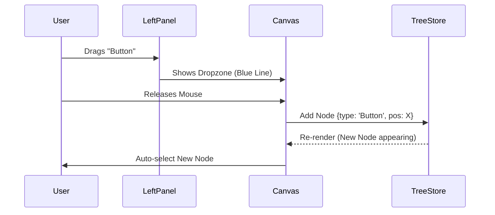
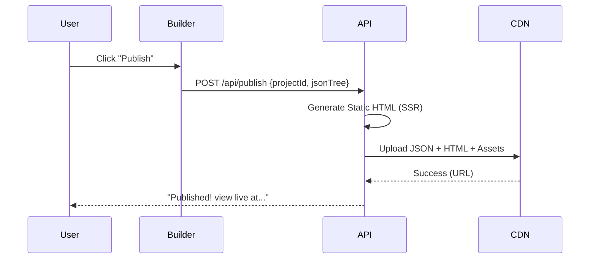

# FlexiSite CMS - UX Design System & Wireframes

**Version:** 1.0.0
**Role:** Senior UI/UX Architect
**Date:** 2026-02-03
**Design Philosophy:** "Complexity hidden behind simplicity." (Inspired by Linear, Framer, Webflow)

---

## 🎨 0. Visual Design Language

Before defining screens, we define the **Interface DNA**.

*   **Typeface**: *Inter* (UI), *JetBrains Mono* (Code/Values).
*   **Grid**: 4px baseline, 8px spacing system.
*   **Colors**:
    *   **Surface**: `White` / `Slate-950` (Dark Mode).
    *   **Panel**: `Slate-50` / `Slate-900`.
    *   **Accent**: `Indigo-600` (Primary Action).
    *   **Border**: `Slate-200` / `Slate-800` (Subtle).
*   **Depth**: No black shadows. Colored shadows (Indigo/Purple glow) for active states. Glassmorphism for floating panels.

---

## 🖥️ 1. Dashboard UI (The Command Center)

**Goal**: Organize multiple projects across multiple tenants with zero clutter.

### Wireframe Diagram
```text
+-----------------------------------------------------------------------+
|  [Logo] FlexiSite    [Search Projects / CMD+K]      [Tenant: Acme v]  |
+-----------------------------------------------------------------------+
|                        |                                              |
|  MENU                  |  Welcome back, Architect.                    |
|  [::] Dashboard    (A) |                                              |
|  [#]  Projects         |  [  Stats Graph (Visits/API Calls)        ]  |
|  [@]  Templates        |                                              |
|  [&]  Integrations     |  Recent Projects              [+ New Proj]   |
|  [$]  Billing          |                                              |
|                        |  +--------------+  +--------------+          |
|  SETTINGS              |  | [Preview]    |  | [Preview]    |          |
|  [o]  Team             |  | **Alpha**    |  | **Beta**     |          |
|  [?]  Help             |  | Updated 2h   |  | Live ●       |          |
|                        |  +--------------+  +--------------+          |
|  [<] Collapse          |                                              |
+------------------------+----------------------------------------------+
```
*(A) Active State: Indigo/10 background, Indigo-600 text, 4px border-left.*

### Interaction Specs
*   **Tenant Switcher**: Dropdown in top-right. Switching tenants instantly filters Projects/Integrations.
*   **Project Card**:
    *   *Hover*: Scale up 1.02x, Show "Edit" and "Settings" quick actions.
    *   *Status Dot*: Green pulse if published. Gray if draft.
*   **Search**: Global search (Projects, Assets, Help articles).

---

## 🏗️ 2. Builder Canvas (The Workhorse)

**Goal**: Maximum working area, intuitive controls.

### Wireframe Diagram
```text
+-----------------------------------------------------------------------+
| [Home] [Page: Home v] [Desktop/Tab/Mob] [Undo/Redo]   [Save] [Publish]|
+--------------------------+------------------------------+-------------+
| LEFT PANEL (Add)         |                              | RIGHT PANEL |
| +---------------------+  |                              | (Props)     |
| | [Add] [Layers] [Pg] |  |  +------------------------+  | [Style]     |
| +---------------------+  |  |                        |  | [Settings]  |
| | > Layout            |  |  |      CANVAS (Iframe)   |  |             |
| |   [Div] [Grid]      |  |  |                        |  | Typography  |
| | > Basic             |  |  |  [ Selected Comp ]     |  | [Inter  v]  |
| |   [Text] [Img]      |  |  |  : 10px Padding      : |  | [16px   v]  |
| | > Forms             |  |  |  :...................: |  |             |
| |   [Input] [Btn]     |  |  |                        |  | Spacing     |
| |                     |  |  +------------------------+  | [T][R][B][L]|
| | [Assets Library]    |  |                              |             |
| +---------------------+  |  [Breadcrumbs: Body > Div]   | Flex Layout |
+--------------------------+------------------------------+-------------+
```

### UX Details
*   **Canvas Interaction**:
    *   *Click*: Selects component (Blue outline `2px`).
    *   *Double Click*: Edit text / Deep select.
    *   *Right Click*: Context Menu (Duplicate, Delete, Wrap in Div, Copy Styles).
    *   *Hover*: Blue dashed outline (Pre-selection).
*   **Zoom**: `Ctrl + Wheel` to zoom canvas. Spacebar to Pan.

---

## 🧱 3. Component Library Panel

**Structure**: A categorized list of draggable elements.

*   **Layout Blocks**: `Section`, `Container`, `Grid` (2-col, 3-col), `FlexBox`.
*   **Basic**: `Heading`, `Text`, `Link`, `Button`, `Icon`.
*   **Media**: `Image`, `Video`, `Lottie`, `Spline 3D`.
*   **Dynamic**: `CMS List`, `Rich Text`, `Form Block`.
*   **Plugins**: `Stripe Checkout`, `Chatbot`, `Google Maps`.

**Visual**: Simple icons + Text. Grid 2x2 layout.

---

## 🎛️ 4. Properties Panel (The Brain)

**Context-Aware**: Changes based on selection.

### Structure (Tabs)
1.  **Style (Paintbrush Icon)**:
    *   **Layout**: Display (Flex/Grid/Block), Direction, Gap.
    *   **Spacing**: Visual Box Model (Click and drag values).
    *   **Size**: W/H (px, %, em, rem, vh, vw).
    *   **Typography**: Font, Weight, Size, Color, Height.
    *   **Background**: Color, Gradient, Image.
    *   **Borders/Effects**: Radius, Shadow, Blur, Opacity.

2.  **Content (Settings Icon)**:
    *   **Source**: Static vs Dynamic (Bind to DB).
    *   **Attributes**: ID, Classes, Alt Text, Link URL.
    *   **Condition**: Visible if `User.LoggedIn == true`.

3.  **Advanced (Code Icon)**:
    *   **Custom CSS**: Raw CSS injection.
    *   **Events**: `onClick` -> `Trigger Webhook` / `Navigate`.

---

## 📑 5. Template Manager

**Goal**: Create once, use everywhere.

### Wireframe Diagram
```text
+-------------------------------------------------------------+
| < Back to Dashboard       **Template Library**              |
+-------------------------------------------------------------+
| [My Templates]  [Community]  [Marketplace]                  |
|                                                             |
| New Template: [Create from Scratch] [Import JSON]           |
|                                                             |
|  +------------------+  +------------------+                 |
|  | [IMG PREVIEW]    |  | [IMG PREVIEW]    |                 |
|  | **SaaS Landing** |  | **Portfolio**    |                 |
|  | Ver: 1.2         |  | Ver: 1.0         |                 |
|  | [Install] [Edit] |  | [Install] [Edit] |                 |
|  +------------------+  +------------------+                 |
+-------------------------------------------------------------+
```
**Data**: Stored in standard FlexiSite JSON format.

---

## 🔌 6. Integration Panel (The USP)

This screen manages the "Headless" and "Embedded" nature.

### Sections
1.  **Product Connection**:
    *   "Connect to External App? [Yes/No]"
    *   **Product ID**: (Unique identifier for the host app).
    *   **Shared Secret**: (For secure handshake).

2.  **Embed Code Generator**:
    *   **Tab 1: Script**: `<script src="..."></script>`
    *   **Tab 2: React**: `npm install @flexisite/react`
    *   **Tab 3: Iframe**: `<iframe src="...">`

3.  **Module Federation**:
    *   **Remote URL**: `https://cdn.flexisite.com/remoteEntry.js`
    *   **Exposed Modules**: `./Renderer`, `./Builder`.

---

## 🚦 7. Interaction Flows (Mermaid)

### Flow 1: Add Component to Page


### Flow 2: Live Publish


---

## 📱 Responsive Layout Behavior

The Builder must simulate devices accurately.
*   **Media Queries**:
    *   **Desktop**: Base styles (min-width: 1024px).
    *   **Tablet**: max-width: 1024px.
    *   **Mobile Landscape**: max-width: 768px.
    *   **Mobile Portrait**: max-width: 480px.

**Cascading Logic**: Styles set on Mobile typically override Desktop. FlexiSite uses **Desktop-First** or **Mobile-First** (User configurable, defaults to Mobile-First for modern standards).

---

## ⚠️ Missing UX / Improvements

1.  **Global Command Palette (`Cmd + K`)**: Essential for power users to find components or settings without clicking menus.
2.  **Interaction Timeline**: A bottom panel to visualize complex animations (GSAP/Framer Motion style) is usually needed for "Premium" sites.
3.  **Collaborative Cursors**: If teams edit together, showing other users' cursors (styles like Figma) is a massive trust-builder.

---
**Signed**: Senior UI/UX Architect
